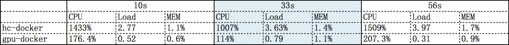
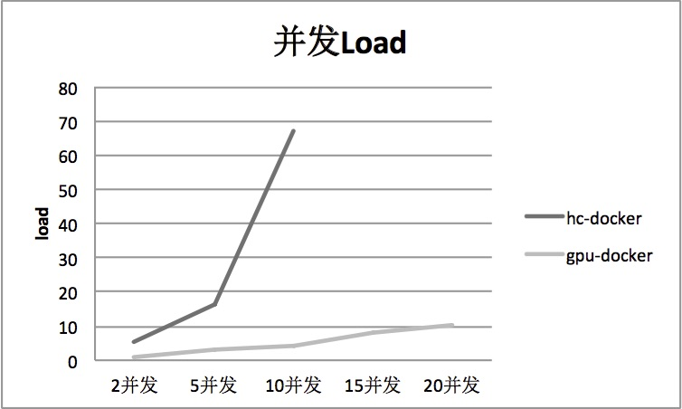
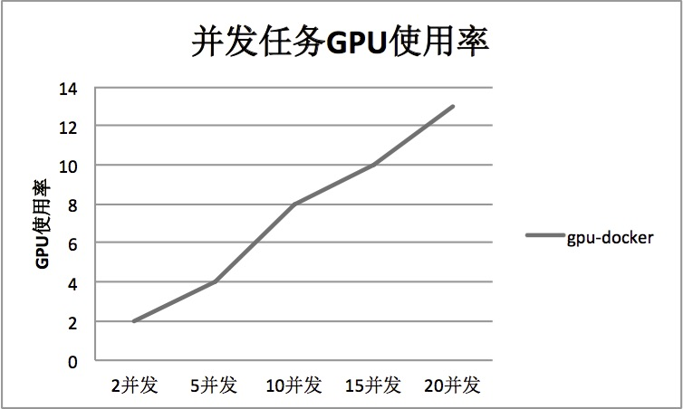

# 背景介绍

标准 docker(4核8G)，性能较差，因此增加 GPU 物理机。

引入 GPU 物理机带来的多少性能提升？服务端目前能拥有的处理能力是多少？因此进行几组性能对比测试，如下所示。

# 一 性能测试环境

|     标准Docker     |    高配Docker     |    带GPU的Docker   |
|:------------------:|:----------------:|:------------------:|
|     4核-8G-60G     |   24核-48G-500G   |    24核-48G-500G   |
|      cpu+mlt       |      cpu+mlt      |   cpu + gpu + mlt  |

`标准Docker` 和 `高配Docker` 底层采用老的同一套 MLT 运行环境。

`带GPU的Docker` 主要针对 GPU 硬件加速编译一套新的 MLT 运行环境。

# 二 单任务性能对比
三组实验数据，生成不同时长的视频。

|       10秒视频      |     33秒视频      |      56秒视频      |
|:------------------:|:----------------:|:------------------:|
|       720×720      |      720×720     |      1280×720      |
|       25.0fps      |      25.0fps     |       25.0fps      |

下面以 33秒 视频性能测试为例说明:

## 1) 标准Docker 4核-8G-60G

```
time melt test.xml -consumer avformat:single_task.mp4
```

耗时 : 1min 34.676s

<video src="imagesAndDatas/single_task_cpu.mp4" controls="controls">
your browser does not support the video tag
</video>

 

## 2) 高配Docker 24核-48G-500G

```
time melt test.xml -consumer avformat:single_task.mp4
```

耗时 : 40.962s

imagesAndDatas/single_task24c48G.mp4

 

## 3) Docker 24核-48G-500G (GPU硬件加速)

```
time melt test.xml -consumer avformat vcodec=h264_nvenc target=single_taskg.mp4
```

耗时 : 35.176s

imagesAndDatas/single_task_gpu.mp4

 

GPU使用情况如下图所示:

 

## 4) 附: Mac 4核8-16G-256G

```
time melt test.xml -consumer avformat:single_task.mp4
```

耗时 : 1min 9.144s

 

## 单任务性能总结:

**1) MLT不同环境单任务耗时:**

 

+ 标准Docker 性能最差，视频越长、质量越高，所需的时间越长。单任务已经满负载。
+ GPU Docker 性能最好，高配Docker性能基本接近

**2) 产出视频大小:**

| 配置  \    视频时长 |    10S     |    33S   |    56S   |
|:-----------------:|:----------:|:--------:|:---------:|
|     std-docker     |   1.5M    |    2.8M   |    2.8M   |
|     hc-docker      |   1.5M    |    2.8M   |    2.8M   |
|     gpu-docker     |   2.5M    |    7.4M   |    15M   |

由于 gpu-docker 采用 h264_nvenc 硬件加速编码器，码率较高，约为2Mbps。若需统一产出视频大小，需针对码率进行控制。

**3) 系统资源使用:**

下表仅包含 `高配Docker` 和 `GPU Docker` 上单个视频合成任务的系统资源使用数据:

 

单任务场景下，由于GPU硬件加速，`GPU Docker` 上视频合成时 CPU资源使用下降80%左右，系统 load 没有明显变化。因此GPU硬件加速的 Docker 能并发处理更多的任务。

# 三 并发性能及压测

为测试 `高配Docker` 和 `GPU Docker` (均为4核8-16G-256G) 的并发任务性能，采用3组并发对比实验。

制作视频长度 33s 。并发5个分组: 2并发, 5并发, 10并发, 15并发, 20并发

并发测试结果如下:

## 3.1) 并发CPU使用率

 

+ `CPU docker` 上并发任务接近10后，CPU利用率无法上升，达到极限。
+ 正常情况下 `GPU Docker` 的CPU使用率下降50%

## 3.2) 并发Load

 

+ `CPU docker` 上并发任务接近10后，Load非常高，达到极限。
+ 正常情况下 `GPU Docker` 的Load下降80%

## 3.3) 并发内存使用率

 

+ 正常情况下 `GPU Docker` 的内存使用率下降50%

## 3.4) 并发任务平均耗时


+ 随着并发数增加， `GPU Docker` 的任务平均耗时更低

## 3.5) 并发任务GPU使用率

 

+ 随着并发数增加， `GPU Docker` 的GPU使用呈线性增长。GPU使用率整体偏低

## 并发测试总结

+ 1) 相同配置下，采用 GPU 硬件加速能使整体性能翻倍。
+ 2) 与原线上标准Docker机器(4核-8G-60G)比，`GPU Docker` 单机预计能力提升20倍。物理机整体上线后，整体性能提升40倍。

# 附录:

**不同平台10s视频:**

```
http://wantu-1lh1-videotool-hz.oss-cn-hangzhou.aliyuncs.com/video_templates/test/single_task10_4c8g.mp4
http://wantu-1lh1-videotool-hz.oss-cn-hangzhou.aliyuncs.com/video_templates/test/single_task10_24c48G.mp4
http://wantu-1lh1-videotool-hz.oss-cn-hangzhou.aliyuncs.com/video_templates/test/single_task10g.mp4
```

**不同平台56s视频:**

```
http://wantu-1lh1-videotool-hz.oss-cn-hangzhou.aliyuncs.com/video_templates/test/single_task_4c8g.mp4
http://wantu-1lh1-videotool-hz.oss-cn-hangzhou.aliyuncs.com/video_templates/test/single_task56_24c48G.mp4
http://wantu-1lh1-videotool-hz.oss-cn-hangzhou.aliyuncs.com/video_templates/test/single_task56_gpu.mp4
```

**测试数据集:**

imagesAndDatas/